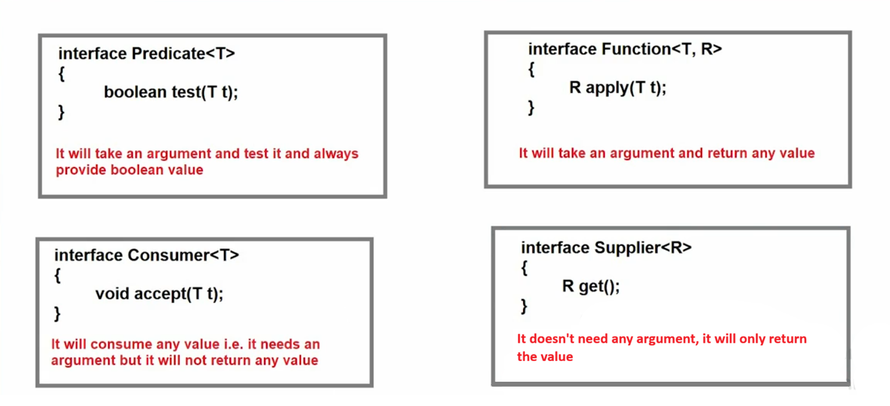

# Predefined Functional Interfaces in Java ☕

Java provides several **predefined functional interfaces** in the `java.util.function` package.
These interfaces are widely used with **Lambda Expressions** and **Stream API**.

---

# 1️⃣ Predicate Interface 🔍

### 👉 Definition

`Predicate` is a functional interface used to **test a condition** and return **true or false**.

### 📦 Package

```
java.util.function
```

### 🧩 Syntax

```java
public interface Predicate<T> {
    boolean test(T t);
    // some default methods are also present
}
```

### ⚙️ Key Points

* Takes **one input parameter**
* Returns **boolean**
* Mostly used for **conditional checks / filtering**

### 💡 Example

```java
Predicate<Integer> p = x -> x > 10;
System.out.println(p.test(15)); // true
```

### 🎯 Use Cases

* Filtering collections
* Condition checking
* Stream API filtering

---

# 2️⃣ Function Interface 🔄

### 👉 Definition

`Function` is used to **take an input and return a result after processing**.

### 📦 Package

```
java.util.function
```

### 🧩 Syntax

```java
public interface Function<T,R> {
    R apply(T t);
    // some default methods are also present
}
```

### ⚙️ Key Points

* Takes **one input**
* Returns **one output**
* Used for **data transformation**

### 💡 Example

```java
Function<Integer, Integer> f = x -> x * x;
System.out.println(f.apply(5)); // 25
```

### 🎯 Use Cases

* Data transformation
* Mapping values
* Stream `.map()` operations

---

# 3️⃣ Consumer Interface 📥

### 👉 Definition

`Consumer` is used when we **only consume data but do not return anything**.

### 📦 Package

```
java.util.function
```

### 🧩 Syntax

```java
public interface Consumer<T> {
    void accept(T t);
}
```

### ⚙️ Key Points

* Takes **one input**
* **No return value**
* Used for **performing actions**

### 💡 Example

```java
Consumer<String> c = name -> System.out.println(name);
c.accept("Java");
```

### 🎯 Use Cases

* Printing values
* Logging
* Processing elements

---

# 4️⃣ Supplier Interface 📤

### 👉 Definition

`Supplier` is used to **return a value without taking any input**.

### 📦 Package

```
java.util.function
```

### 🧩 Syntax

```java
public interface Supplier<R> {
    R get();
}
```

### ⚙️ Key Points

* **No input parameter**
* **Returns a value**
* Used to **generate or supply data**

### 💡 Example

```java
Supplier<Double> s = () -> Math.random();
System.out.println(s.get());
```

### 🎯 Use Cases

* Random values
* Object creation
* Lazy value generation

---

# 📊 Difference Between Predicate, Function, Consumer & Supplier

| Interface    | Input        | Output       | Main Purpose         |
| ------------ | ------------ | ------------ | -------------------- |
| 🔍 Predicate | 1 Parameter  | boolean      | Test a condition     |
| 🔄 Function  | 1 Parameter  | Return value | Transform data       |
| 📥 Consumer  | 1 Parameter  | No return    | Perform action       |
| 📤 Supplier  | No parameter | Return value | Supply/generate data |




---

# 🎯 Quick Summary

| Interface | Method     | Example Use     |
| --------- | ---------- | --------------- |
| Predicate | `test()`   | Check condition |
| Function  | `apply()`  | Convert data    |
| Consumer  | `accept()` | Print / process |
| Supplier  | `get()`    | Generate value  |

---

✅ **Memory Trick**

```
Predicate → Test something
Function  → Transform something
Consumer  → Use something
Supplier  → Provide something
```

---
